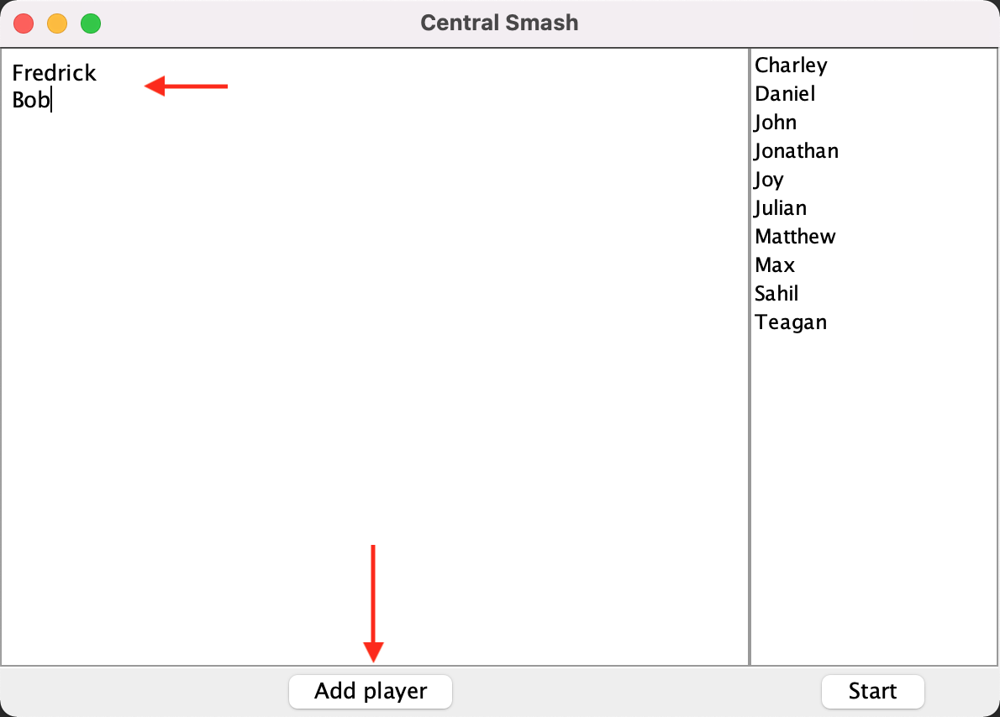

# TournamentBracketGenerator

An application which generates an interactive double elimination style tournament bracket. Users can add and select participants for a tournament. Enter match scores to advance participants in the tournament. User interface implemented using Java swing and JGraphX library to display tournament brackets.

